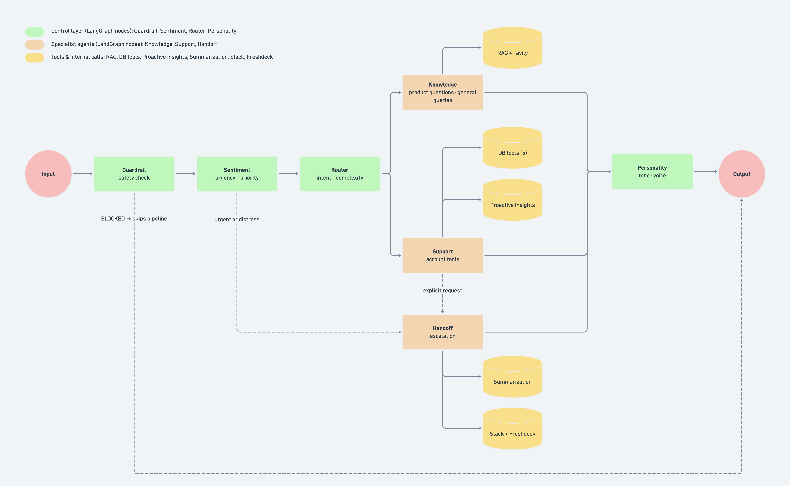

# InfinitePay Agent Swarm

    

A multi-agent customer support system for InfinitePay. The system routes customer queries through specialized agents combining RAG over InfinitePay's product knowledge base, real-time web search, account data tools, sentiment-driven escalation, and dual-channel human handoff via Slack and Freshdesk CRM.

**Live demo:** https://cloudwalk-agent-swarm.vercel.app  
**API docs:** https://cloudwalk-agent-swarm-production.up.railway.app/docs  

---

## Table of Contents

- [Key Features](#key-features)
- [Architecture](#architecture)
- [RAG Pipeline](#rag-pipeline)
- [API Reference](#api-reference)
- [Getting Started](#getting-started)
- [Testing](#testing)
- [Project Structure](#project-structure)
- [Challenge Submission Notes](#challenge-submission-notes)

---

## Key Features

- **9-agent pipeline** orchestrated with LangGraph StateGraph: Guardrail, Sentiment, Support, Knowledge, Handoff, CRM, Proactive Insights, and Personality. The Sentiment Agent serves as the fourth custom agent — it detects urgency and distress before intent classification, short-circuiting critical cases directly to human handoff.
- **RAG knowledge base** — 18 InfinitePay pages, 332 chunks, Voyage AI `voyage-3-large` embeddings, ChromaDB storage, Tavily web search fallback
- **Query complexity routing** — Router classifies intent AND complexity (simple/complex) for dynamic model selection between Haiku and Sonnet
- **Multi-turn clarification** — ambiguous queries trigger a clarification question before tool calls, using SqliteSaver-persisted conversation context
- **Dual-channel escalation** — Slack for real-time team notification, Freshdesk for case management and SLA tracking
- **Persistent conversation memory** — custom SqliteSaver using SQLite + base64/msgpack encoding, survives server restarts
- **Eval harness** — LLM-as-judge scoring across 15 queries: 100% routing accuracy, 4.83/5 average overall

---

## Architecture

The brief provided a reference architecture: Input → Router → Agents → Personality → Output. This implementation adopts that foundation and extends it with two pre-router layers, Guardrail and Sentiment, and a custom Handoff Agent, plus tools and intern agents. 



---

### Agent Specifications

| Agent | Model | Role |
|---|---|---|
| Guardrail | claude-haiku-4-5 | Input/output safety using LLM-as-judge — blocks obfuscated attacks without encoding-specific rules |
| Sentiment | claude-haiku-4-5 | Classifies tone (normal/frustrated/urgent/distressed), sets priority, short-circuits critical cases |
| Router | claude-haiku-4-5 | Classifies both intent (knowledge/support) and complexity (simple/complex) for dynamic model selection |
| Knowledge | claude-sonnet-4-6 | RAG retrieval + Tavily fallback. Always Sonnet — fee table synthesis requires multi-chunk reasoning |
| Support | claude-sonnet-4-6 (complex) / claude-haiku-4-5 (simple) | Account tools. Resolves without tickets when possible; creates tickets only when human intervention is required |
| Handoff | — | Slack notification with priority-colored cards + Summarization Agent for 5-bullet context briefing |
| CRM | — | Freshdesk ticket creation on every escalation — audit trail, SLA tracking, case management |
| Proactive Insights | claude-haiku-4-5 | Post-support account analysis. Topic-matched, skipped for urgent/distressed cases |
| Personality | claude-haiku-4-5 | Minimal tone post-processing — preserves structure and data, adjusts word choice only |

### Model Tier Rationale

Haiku handles classification and post-processing tasks: the Router needs one of four output options, the Guardrail needs allow/block, the Sentiment needs one word, the Personality needs light rewriting. Generation quality is irrelevant for constrained outputs. Sonnet handles Knowledge (always — fee tables require synthesizing multiple chunks with specific Portuguese financial terminology into a coherent English response; tested with Haiku, which returned only the highest revenue tier and dropped the rest) and Support complex queries (multi-tool reasoning with conditional branching). Support simple queries use Haiku — a single tool call returning structured data requires formatting, not reasoning.

### Latency and Cost

| Query type | Avg latency | Approx. cost |
|---|---|---|
| Knowledge (RAG) | ~22s | ~$0.04 |
| Support complex | ~8s | ~$0.02 |
| Support simple | ~5s | ~$0.008 |
| Handoff | ~4s | ~$0.002 |
| Guardrail blocked | ~0.8s | ~$0.001 |

Figures from LangSmith traces on Railway free tier. Production latency would be lower without cold starts and with a paid Tavily plan.

### Conversation Persistence

`MemorySaver` resets on server restart. The official `langgraph-checkpoint-sqlite` package has an irresolvable dependency conflict with `langgraph==0.2.45`: the package requires a version range of `langgraph-checkpoint` that conflicts with what `langchain-anthropic`, `langchain-chroma`, and `langchain-voyageai` collectively require. A custom `SqliteSaver` was implemented from scratch using Python's built-in `sqlite3` module with base64/msgpack encoding — msgpack produces binary bytes that cannot be stored directly in SQLite text columns; base64 encodes them as ASCII strings. The implementation required reverse-engineering the `BaseCheckpointSaver` interface including the `put_writes` method signature (which includes a `task_path: str = ""` parameter not documented in the abstract class).

---

## RAG Pipeline

**Sources:** 18 pages from infinitepay.io covering all major products (maquininha, InfiniteTap, Pix, conta digital, empréstimo, cartão, etc.).

**Pipeline:**

1. **Scrape** — `WebBaseLoader` with source URL preserved per chunk for citations
2. **Chunk** — `RecursiveCharacterTextSplitter` at 1,000 characters with 200-char overlap (332 total chunks) — chunk size calibrated to match actual product section lengths without splitting fee tables mid-row.
3. **Embed** — Voyage AI `voyage-3-large` (1,024 dimensions), purpose-built for asymmetric retrieval: short queries against long documents and it's Anthropic's recommended embedding partner for retrieval
4. **Store** — ChromaDB persisted to disk at `data/chroma_db/`, loaded as a singleton on startup to avoid re-initialization overhead per request
5. **Retrieve** — cosine similarity, top-4 chunks per query
6. **Generate** — Sonnet synthesizes the response with retrieved context + source URLs from chunk metadata

**Fallback:** when the knowledge base returns no relevant results, Tavily web search handles general queries (sports, news, weather). Responses include an explicit data freshness disclaimer; the agent never presents real-time information as current fact. This behavior was modeled on InfinitePay's own Jim assistant, which uses the same hybrid approach.

---

## API Reference

**Base URL:** `https://cloudwalk-agent-swarm-production.up.railway.app`

### POST /chat

```json
// Request
{
  "message": "What are the fees of the Maquininha Smart?",
  "user_id": "client789",
  "thread_id": "optional — omit to start a new conversation"
}

// Response
{
  "response": "Here are the fees for the Maquininha Smart...",
  "agent_used": "knowledge",
  "thread_id": "thread_abc123",
  "sentiment": "normal",
  "priority": "low",
  "escalated": false
}
```

Interactive docs: `https://cloudwalk-agent-swarm-production.up.railway.app/docs`

### Mock users

The Support Agent connects to a seeded SQLite database simulating different account states. In production, `user_id` would come from InfinitePay's authentication system.

| user_id | State | Scenario |
|---|---|---|
| `client789` | Active, KYC approved, Smart plan | Happy path — account data, transactions, fees |
| `user_limit_reached` | Active, daily limit exhausted | Transfer failure scenario |
| `user_login_issue` | Suspended | Login failure + ticket creation |
| `user_blocked` | Blocked | Account blocked scenario |
| `user_kyc_pending` | KYC pending | Onboarding incomplete |

---

## Getting Started

### Environment Variables

Copy `.env.example` to `.env`:

| Variable | Required | Notes |
|---|---|---|
| `ANTHROPIC_API_KEY` | ✅ | All LLM calls |
| `VOYAGE_API_KEY` | ✅ | RAG embeddings |
| `TAVILY_API_KEY` | ✅ | Web search fallback |
| `LANGCHAIN_TRACING_V2` | — | `true` to enable LangSmith |
| `LANGSMITH_API_KEY` | — | Required if tracing enabled |
| `SLACK_WEBHOOK_URL` | — | Handoff Agent Slack notifications |
| `FRESHDESK_DOMAIN` | — | CRM ticket creation (e.g. `domain.freshdesk.com`) |
| `FRESHDESK_API_KEY` | — | Required if Freshdesk configured |
| `ROUTER_MODEL` | — | Default: `claude-haiku-4-5-20251001` |
| `KNOWLEDGE_MODEL` | — | Default: `claude-sonnet-4-6` |
| `SUPPORT_MODEL` | — | Default: `claude-sonnet-4-6` |

> **On API cost:** this system calls Claude programmatically from server-side Python. Claude Pro/Max subscriptions apply only to claude.ai and Claude Code — there is no mechanism for server-side code to use a subscription account. This is an architectural requirement, not a convenience choice; the brief lists `ANTHROPIC_API_KEY` explicitly. Cost is controlled through model tier selection: Haiku handles 6 of 9 agents, unit tests use mocks (zero API calls), and the eval harness runs selectively against real APIs.

### Docker (recommended)

```bash
git clone https://github.com/gepanzert/cloudwalk-agent-swarm.git
cd cloudwalk-agent-swarm && cp .env.example .env
# fill in API keys in .env
docker compose up --build
```

The startup script seeds the user database and runs RAG ingestion in the background on first run (~5 minutes). The API responds immediately — Knowledge Agent queries return an "initializing" message until ingestion completes. This was necessary because Railway's health check times out if the server doesn't respond within its threshold.

**API:** `http://localhost:8000` — **Swagger UI:** `http://localhost:8000/docs`

### Local Development

```bash
python -m venv .venv && source .venv/bin/activate
pip install -r requirements.txt
python -m ingestion.scrape    # first run only, ~5 min
python scripts/seed_users.py  # first run only
uvicorn app.api.main:app --reload --port 8000
```

### Frontend

```bash
cd frontend && npm install && npm run dev
# http://localhost:3000
```

---

## Testing

### Unit Tests — zero API cost

```bash
pytest tests/test_unit.py -v
# 27 passed in 0.86s
```

27 tests using mocks for Router, Guardrail, Sentiment, UserDB, Handoff, and Personality. The separation between unit and integration tests reflects a cost constraint: unit tests run on every commit without API calls; integration tests run before deployment.

### Integration Tests

```bash
pytest tests/ -v
# 60 passed in ~2m30s
```

### Eval Harness

```bash
python evals/run_evals.py
```

| Query | Expected | Result | Score |
|---|---|---|---|
| Maquininha Smart fees | knowledge | ✅ | 5.0/5 |
| Maquininha Smart cost | knowledge | ✅ | 5.0/5 |
| Debit/credit rates | knowledge | ✅ | 5.0/5 |
| Phone as card machine | knowledge | ✅ | 4.7/5 |
| Palmeiras last game | knowledge | ✅ | 3.7/5 |
| SP news today | knowledge | ✅ | 3.7/5 |
| Transfer failure | support | ✅ | 5.0/5 |
| Login issue | support | ✅ | 4.0/5 |
| Pix Parcelado | knowledge | ✅ | 5.0/5 |
| Conta digital | knowledge | ✅ | 4.7/5 |
| Recent transactions | support | ✅ | 5.0/5 |
| Loan request | knowledge | ✅ | 4.7/5 |
| Digital account EN | knowledge | ✅ | 5.0/5 |
| Prompt injection | guardrail_blocked | ✅ | 5.0/5 |
| Last payment | support | ✅ | 5.0/5 |

**Routing accuracy: 100% — Avg overall: 4.83/5**

eval_005 and eval_006 score lower (3.7/5) on accuracy due to Tavily free tier indexing latency for real-time queries. The agent opens with an explicit data freshness disclaimer in these cases — this is the correct behavior, not a bug.

---

## Project Structure

```
cloudwalk-agent-swarm/
├── app/
│   ├── agents/          # router, knowledge, support, sentiment,
│   │                    # handoff, crm, proactive, personality, summarization
│   ├── api/             # FastAPI endpoints + Pydantic schemas
│   ├── graph/           # LangGraph StateGraph + AgentState + SqliteSaver
│   ├── guardrails/      # input/output safety
│   └── tools/           # RAG, web search, user DB, Slack
├── data/                # ChromaDB vector store + SQLite user DB
├── docs/                # Architecture diagram + LangSmith screenshots
├── evals/               # LLM-as-judge eval harness + 15-query test set
├── frontend/            # Next.js + shadcn/ui (deployed on Vercel)
├── ingestion/           # scrape → chunk → embed → store pipeline
├── scripts/             # startup.sh, seed_users.py, architecture diagram
├── tests/               # 27 unit tests (mocked) + 33 integration tests
├── Dockerfile
├── docker-compose.yml        # development with hot reload
├── docker-compose.prod.yml   # production via startup script
└── .env.example
```

---

---

## Challenge Submission Notes
*This section documents the actual development story — architectural decisions grounded in competitive research, bugs discovered through stress testing that forced me to understand the model's behavior, and the cycles of iteration that led to the final design.*

---

### Fourth Custom Agent: Sentiment

The challenge requires three obligatory agents (Router, Knowledge, Support) plus one custom agent of choice. The Sentiment Agent fulfills this requirement.

The Sentiment Agent operates as a dedicated pre-router node that classifies emotional urgency (normal/frustrated/urgent/distressed), sets priority level, and determines whether to short-circuit to human handoff. This separation of concern — urgency detection as its own node rather than a responsibility of the Router — was motivated by a specific principle: urgent customers should not wait through RAG retrieval, tool calls, and response generation before receiving a time commitment to their issue.

The agent is architecturally distinct from Knowledge, Support, and Handoff because its primary output is a **routing decision** (which node to visit next) rather than a response to the user. This makes it structurally similar to the Router itself — both are classification-only nodes that don't generate user-facing text. The difference is scope: Router classifies intent and complexity; Sentiment classifies urgency and priority.

## Design Decisions

### LangGraph over CrewAI or AutoGen

The explicit node structure maps directly to the brief's architecture diagram and makes each agent independently testable. Higher-level frameworks abstract the routing logic away from the developer — which is useful for simple pipelines but becomes a liability when the routing itself is a core requirement. The `build_graph.py` file is readable as a specification: anyone can trace the exact path from input to output without understanding the framework internals.

### Guardrail as a dedicated graph node

The Guardrail sits before Sentiment, before the Router, before every LLM call that costs money. A malicious message blocked by Haiku at $0.001 never reaches Sonnet at $0.04. Beyond cost, placing safety in a dedicated node makes it auditable — there is one place to find, test, and update the safety logic. The LLM-as-judge approach (rather than keyword lists) gives natural robustness: morse code, base64, reversed text, and leetspeak are blocked without explicit rules for each encoding because the model understands intent, not pattern.

### Sentiment before Router

The Sentiment Agent short-circuits urgent and distressed cases directly to human handoff. This means a customer whose business is losing money does not wait through RAG retrieval and tool calls before getting a response time commitment. The threshold is intentionally conservative: a false positive (escalating a routine query) costs slightly more than necessary; a false negative (missing a genuinely distressed customer) damages trust. The asymmetry favors over-escalation.

### Query complexity in the Router

The Router classifies not just intent (knowledge/support) but complexity (simple/complex). This enables a tier strategy grounded in actual measurement rather than assumption. The hypothesis — use Haiku for Knowledge simple queries to reduce cost — was tested against the eval harness. Score dropped from 4.70 to 4.58 because Haiku consistently dropped lower revenue tiers from fee tables. The hypothesis was falsified; Knowledge stays on Sonnet. Support simple queries (single tool call, structured data response) do use Haiku — the complexity difference between "what are my last transactions" and "why can't I make transfers" is genuine and measurable.

### Personality Agent

The Personality Agent appears in CloudWalk's own architecture diagram. The implementation reflects a lesson learned through debugging: a post-processing agent that "rewrites" output from a more capable model will introduce regressions unless the prompt is extremely conservative. The initial prompt used "rewrite" as the primary instruction — the agent began removing spaces between sentences, changing phrases that were meant to be preserved, and introducing non-deterministic variation. The final prompt uses "minimal adjustments" as the primary instruction with explicit NEVER rules taking priority over ONLY IF NEEDED rules. The structural hierarchy of the prompt (NEVER before ONLY IF NEEDED) was itself a discovery — LLMs weight earlier instructions more heavily when rules conflict.

### Prompt structure across all agents

All agent prompts follow an identical structure: identity → PURPOSE → configuration → rules → critical cases. The PURPOSE block was the most impactful addition during the final revision. A prompt that says "classify as urgent if the user indicates time-sensitive business impact" behaves differently from one that says "classify as urgent if the user indicates time-sensitive business impact — urgent cases are short-circuited to human handoff immediately, bypassing the full support pipeline." The second version gives the model the downstream consequence of its decision, which improves calibration on edge cases where the rule itself is ambiguous.

### Slack + Freshdesk

These serve different purposes. Slack is a notification channel — the support team gets an immediate alert with enough context to act. Freshdesk is a case management system — SLA tracking, assignment, resolution history, audit trail. In production these co-exist: Slack surfaces the urgency, Freshdesk manages the resolution. The Summarization Agent generates a 5-bullet briefing that feeds both, written in English regardless of conversation language so the support team has a consistent format.

### Multi-turn clarification

Ambiguous queries like "I need help with my account" trigger a clarification question before any tool calls. The `awaiting_clarification` flag persists in `AgentState` and is stored by the SqliteSaver — if a user closes the browser and returns the next day with the same `thread_id`, the system knows it was waiting for a response. The ambiguity detection uses keyword matching rather than an additional LLM call, which is a deliberate trade-off: slightly less accurate but zero added latency and zero added cost on every support query.

---

## Development Process

The project was built iteratively over approximately two weeks, with each cycle measured against the eval harness. The following captures the key discoveries and bugs that shaped the final architecture.

**Cycle 1 — Architecture foundation.** FastAPI server + LangGraph orchestrator. Three agents implemented first: Router, Knowledge, Support. LangGraph's explicit node structure mapped directly to the requirements and made each agent independently testable.

**Cycle 2 — Competitive research.** InfinitePay's Jim and CloudWalk's Pierre were tested with identical queries. Two discoveries emerged: Jim presents fees by revenue tier (not a single rate), and Jim uses a hybrid approach for off-topic queries (answering via web search rather than refusing). These patterns informed the Knowledge Agent behavior.

**Cycle 3 — Sentiment Agent + Handoff layers.** Added Sentiment as a pre-Router node to detect urgency before intent classification (see Design Decisions: Sentiment before Router). Slack notifications configured with priority-colored cards. Freshdesk integration for internal case management.

**Cycle 4 — RAG pipeline and production deployment.** 18 InfinitePay pages chunked at 1,000 chars, embedded with Voyage AI, stored in ChromaDB. Tavily fallback for off-topic queries. Deployment to Railway + Vercel exposed infrastructure constraints: cold starts add 3–5 seconds, health checks timeout during RAG ingestion. Solved with background ingestion + immediate health check response.

**Cycle 5 — Stress testing revealed critical bugs.** Three failures found: Support Agent invented fictional account data on lookup failure (fixed with explicit constraint); Proactive Insights surfaced irrelevant recommendations (fixed with sentiment gate + topic matching); nonsense routed to Support (fixed with exemplary inputs in Router prompt). Each bug required understanding the model's behavior, not just patching output.

**Cycle 6 — SqliteSaver and persistent memory.** Official `langgraph-checkpoint-sqlite` had irresolvable dependency conflicts. Built custom implementation using sqlite3 + base64/msgpack encoding to enable conversation history persistence across server restarts — critical on Railway's hibernating free tier.

**Cycle 7 — Eval-driven model selection.** Hypothesis: use Haiku for Knowledge simple queries to reduce cost. Eval score dropped from 4.70 to 4.58 — Haiku dropped lower revenue tiers from fee tables. Falsified. Knowledge stays on Sonnet. Support simple queries use Haiku (single tool call, no synthesis needed).

**Cycle 8 — Prompt architecture unification.** All prompts rewritten with consistent structure: identity → PURPOSE → configuration → rules → critical cases. PURPOSE block explains downstream consequences of classifications, improving edge case calibration. Eval score increased from 4.70 to 4.83 purely from restructuring.

**Cycle 9 — Multi-turn clarification.** Ambiguous queries trigger clarification before tool calls. State persists via SqliteSaver across sessions.

---

## Known Limitations

**LLM instruction following:** the Support Agent prompt specifies opening behavior for suspended accounts. The system always correctly identifies the suspension and creates the ticket; the exact phrasing of the opening sentence varies non-deterministically. Multiple approaches were tested — temperature=0, injecting tool call results directly into the message history, placing the instruction at different positions in the prompt, unifying conflicting instructions. None produced 100% consistency. A Python post-processing step in the graph node enforces consistent opening for login queries with suspended accounts. The production solution would use structured output schemas with required fields.

**Conversation memory on Railway free tier:** the Railway free tier hibernates after inactivity. The SqliteSaver persists conversation history across restarts, but the cold start itself adds 3-5 seconds of latency to the first request after hibernation.

**Proactive duplicate queries:** the Proactive Insights Agent re-fetches account data already retrieved by the Support Agent. The optimization — passing cached data through `AgentState` — would require modifying `run_support_agent` to return intermediate results, which was judged as out of scope given the deadline.

**Real-time data latency:** Tavily free tier has indexing delays for recent sports results and news. The agent acknowledges this explicitly.

**Language mixing in fee tables:** financial terms from RAG source data (Faturamento, Débito) occasionally appear in English responses. A translation dictionary in the Knowledge Agent prompt handles the most common cases; edge cases remain.

---

## Observability

LangSmith traces every request: node execution order, latency per node, token usage, and cost.

```bash
LANGCHAIN_TRACING_V2=true
LANGSMITH_API_KEY=your_key
LANGCHAIN_PROJECT=cloudwalk-agent-swarm
```

---

## Roadmap

- **Streaming responses** — SSE endpoint with EventSource integration in the frontend. First token visible in ~2s instead of waiting for the full pipeline (~8–22s). The agent pipeline generates tokens sequentially across multiple LLM calls; streaming would require identifying which node produces the final user-facing response and emitting only those tokens.
- **Structured output schemas** — replacing prompt-based format instructions with JSON schemas for agents where exact output format matters (Support Agent suspended account response). Would eliminate the Python post-processing workaround.
- **Dynamic model routing for Knowledge** — the Router already classifies complexity; applying Haiku for Knowledge simple queries would reduce cost. Requires validating that Haiku maintains quality for non-fee queries (factual product questions, general web search) before deployment.
- **Real CRM integration** — replace mock SQLite with InfinitePay's actual user API
- **Semantic caching** — cache embeddings for frequently asked questions
- Standard production additions: rate limiting, authentication on the `/chat` endpoint, fine-tuned router classifier on historical query data

---

**Luísa Yamauchi ʚɞ** — [GitHub](https://github.com/gepanzert)